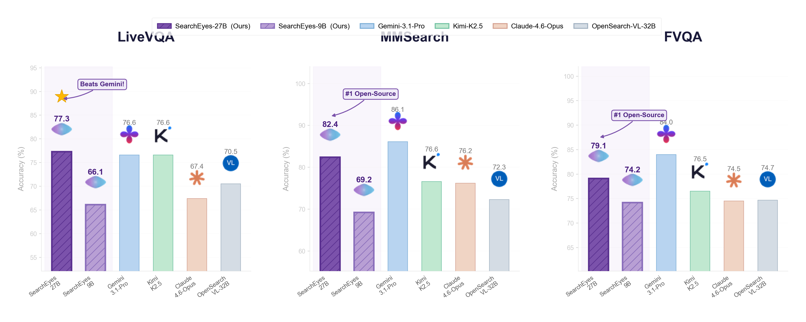

<p align="center">
  
</p>

<h1 align="center">SearchEyes</h1>

<p align="center">
  <b>Towards Frontier Multimodal Deep Search Intelligence via Search World Simulation</b>
</p>

<p align="center">
  <a href="https://arxiv.org/abs/xxxx.xxxxx">Paper</a> &bull;
  <a href="https://github.com/Frostlinx/SearchEyes">Code</a> &bull;
  <a href="#vissearch-bench">Benchmark</a> &bull;
  <a href="#model-weights">Model Weights</a>
</p>

<p align="center">
  
</p>

---

## TL;DR

Existing multimodal search agent pipelines suffer from a fundamental **structural disconnect**: training data, search environment, and reward signals are constructed independently. SearchEyes resolves this by using a **typed knowledge graph as a unified backbone** that simultaneously serves as:

1. **Data Generator** — Perception-Knowledge Chain (PKC) synthesis produces high-quality multi-hop questions with structural guarantees
2. **Search Simulator** — A self-contained, deterministic retrieval environment (BM25 + dense + RRF) with no external API dependency
3. **Reward Anchor** — Gold entity sequences retained from synthesis provide step-level credit assignment signals for RL

This co-design enables **SearchEyes-27B** to achieve state-of-the-art performance among open-source multimodal search agents, improving over the strongest baseline by **+6.2 points** on average across six benchmarks.

---

## Method

### Overview: Unified Search World Simulation

<p align="center">
  
</p>

**(a) PKC Synthesis** (top): Starting from a typed knowledge graph (Wikidata5M ∩ Wiki6M ∩ Wikipedia images), we sample constrained multi-hop paths with P–K alternation, treewidth-2 disambiguation, domain diversity, and anti-shortcut filtering. Information concealment ensures no entity name leaks into questions.

**(b) Self-Contained Search World** (bottom): The same knowledge graph defines a fully deterministic retrieval environment. Hybrid BM25 + dense retrieval fused via RRF eliminates external API dependencies, enabling reproducible training.

### Agentic Post-Training: SFT + HaPO

<p align="center">
  
</p>

**Stage 1 — SFT with Privileged Generation**: An expert model generates trajectories in a retrieval-boosted environment. Accepted trajectories are denoised and exported with raw observations for masked-observation supervised training.

**Stage 2 — Hop-Anchored Policy Optimization (HaPO)**: Online rollouts are grouped by shared gold entity anchors to compute step-level advantages. The final advantage blends hop-level and trajectory-level signals:

```
A_final(i, t) = α · A_episode(i) + (1-α) · A_hop(i, t)
```

Key components:
- **Hop-anchored grouping**: Trajectories that retrieve the same gold entity are compared at that state
- **Fatal-aware masking**: Suppresses gradient from degenerate trajectory suffixes (consecutive tool errors)
- **Smooth asymmetric gating**: Replaces hard PPO clipping with sigmoid-based gate (γ⁻ > γ⁺)
- **One-sided clamping**: Retains positive signals from valid prefixes preceding exogenous failures

---

## Results

### Main Comparison (6 Benchmarks)

| Model | SimpleVQA | VDR | MMSearch | LiveVQA | BC-VL | FVQA | **Avg.** |
|-------|:---------:|:---:|:--------:|:-------:|:-----:|:----:|:--------:|
| SearchEyes-27B (Ours) | 80.9 | **39.4** | **82.4** | **77.3** | **49.3** | 79.1 | **68.1** |
| SearchEyes-9B (Ours) | 75.4 | 28.3 | 69.2 | 66.1 | 42.3 | 74.2 | 59.3 |
| OpenSearch-VL-32B | 76.2 | 33.8 | 72.3 | 70.5 | 43.8 | 74.7 | 61.9 |
| Gemini-3.1-Pro (Agentic) | – | – | 86.1 | 76.6 | 64.1 | 84.0 | – |
| Kimi-K2.5 (Agentic) | – | – | 76.6 | 76.6 | 50.3 | 76.5 | – |
| Claude-4.6-Opus (Agentic) | – | – | 76.2 | 67.4 | 48.3 | 74.5 | – |
| GPT-5 (Agentic) | 67.3 | 17.6 | 62.7 | – | 57.6 | 62.0 | – |

### Parameter Efficiency

<p align="center">
  
</p>

SearchEyes-9B matches 30B-scale baselines (OpenSearch-VL-30B at 59.8%) with **3.3× fewer parameters**, demonstrating the data efficiency unlocked by PKC + HaPO.

---

## Installation

```bash
git clone https://github.com/Frostlinx/SearchEyes.git
cd SearchEyes
pip install -e .

# With training dependencies (torch, verl, deepspeed)
pip install -e ".[train]"

# With evaluation dependencies (vllm, matplotlib)
pip install -e ".[eval]"
```

**Requirements**: Python ≥ 3.10, PyTorch ≥ 2.1

---

## Quick Start

### 1. PKC Data Synthesis

Generate multi-hop visual questions from the knowledge graph:

```bash
python -m searcheyes.pgkc_pipeline \
    --kg-path data/wikidata5m/ \
    --wiki6m-path data/wiki6m/ \
    --output-dir data/pkc_output/ \
    --num-questions 10000 \
    --min-hops 3 --max-hops 5
```

### 2. SFT Training

Train with expert trajectories (masked observation loss):

```bash
bash scripts/training/run_train.sh
```

### 3. HaPO (RL Training)

Run hop-anchored policy optimization:

```bash
bash scripts/training/run_rl.sh
```

### 4. Evaluation

Evaluate on supported benchmarks:

```bash
bash scripts/evaluation/run_eval.sh \
    --model-path <checkpoint> \
    --benchmark mmsearch \
    --max-turns 50
```

---

## VisSearch Bench

We introduce **VisSearch Bench**, a dedicated 1000-question benchmark for multi-hop visual search with guaranteed P–K alternating structure, disambiguating constraints, and multi-domain coverage.

```python
import json

with open("data/vissearch_bench.json") as f:
    bench = json.load(f)

print(f"Total questions: {len(bench)}")
# Each entry: question_id, image_path, question, answer,
#             chain (hop sequence), constraints, num_hops, hop_types
```

| Model | VisSearch Acc. |
|-------|:-------------:|
| SearchEyes-27B | **24.3** |
| SearchEyes-9B | 18.6 |
| OpenSearch-VL-32B | 9.4 |
| Kimi-K2.5 | 7.2 |
| GPT-5 | 5.4 |

Even frontier proprietary models achieve <10%, reflecting genuine multi-hop difficulty that single-turn reasoning cannot bypass.

---

## Model Weights

| Model | Base | HF Link |
|-------|------|---------|
| SearchEyes-9B | Qwen3.5-9B | Coming soon |
| SearchEyes-27B | Qwen3.5-27B | Coming soon |

---

## Project Structure

```
SearchEyes/
├── searcheyes/              # Core Python package
│   ├── hapo.py              # HaPO algorithm
│   ├── pgkc_synthesizer.py  # PKC multi-hop question synthesis
│   ├── pgkc_graph.py        # Knowledge graph traversal
│   ├── pgkc_filter.py       # Anti-shortcut filtering
│   ├── pgkc_pipeline.py     # End-to-end PKC pipeline
│   ├── sft_synthesis.py     # SFT trajectory generation
│   ├── rag_engine.py        # Hybrid BM25+dense retrieval (RRF)
│   ├── vdr_agent.py         # Multi-turn ReAct search agent
│   ├── vdr_tools.py         # Tool implementations (5 tools)
│   ├── reward_fn.py         # Reward function for verl
│   └── ...
├── scripts/
│   ├── training/            # SFT & RL training scripts
│   ├── evaluation/          # Benchmark evaluation
│   └── data_processing/     # KB construction & indexing
├── configs/                 # DeepSpeed & tool configs
├── data/                    # VisSearch Bench & task data
├── experiments/             # Ablation experiments & results
└── assets/                  # Figures for README
```

---

## Citation

```bibtex
@article{jiao2026searcheyes,
  title={SearchEyes: Towards Frontier Multimodal Deep Search Intelligence via Search World Simulation},
  author={Jiao, Zhengbo and Cheng, Yiming and Jiang, Yilei and Feng, Kaituo and Huang, Rui and Jiang, Tianyi and Tian, Juanxi and Wang, Qunzhong and Chen, Tailai and Wei, Qianshan and Xiao, Chuan and Rong, Shanyu and Li, Yangfu and Zhou, Yanhan and Zhang, Yifan and Yue, Xiangyu},
  journal={arXiv preprint arXiv:xxxx.xxxxx},
  year={2026}
}
```

## License

This project is released under the [Apache 2.0 License](LICENSE).

## Acknowledgments

We thank the teams behind [Wikidata5M](https://deepgraphlearning.github.io/project/wikidata5m), [Wiki6M / OVEN-Wiki](https://open-vision-language.github.io/oven/), and the open-source RL training framework [verl](https://github.com/volcengine/verl) that made this work possible.
