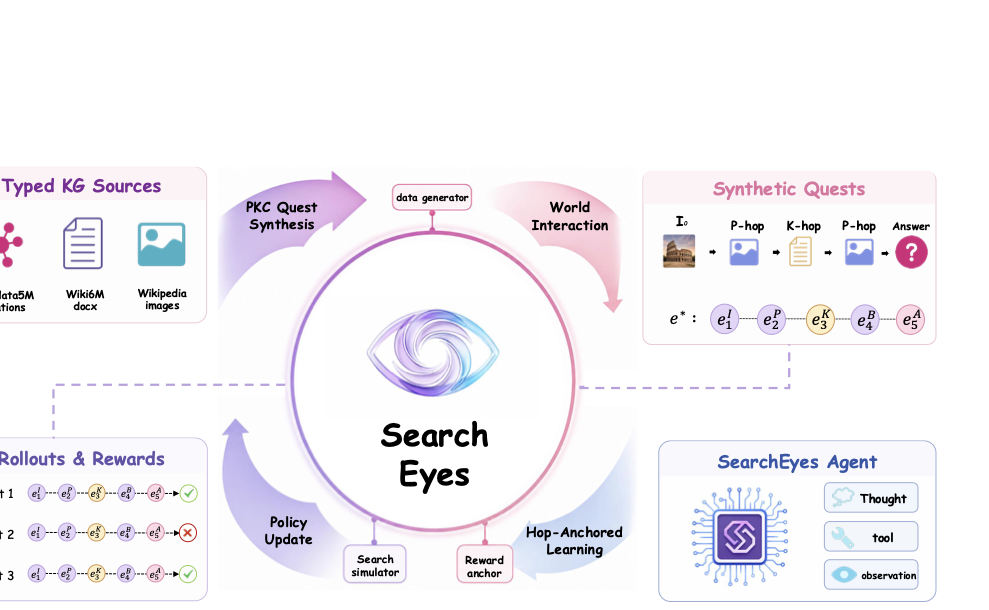
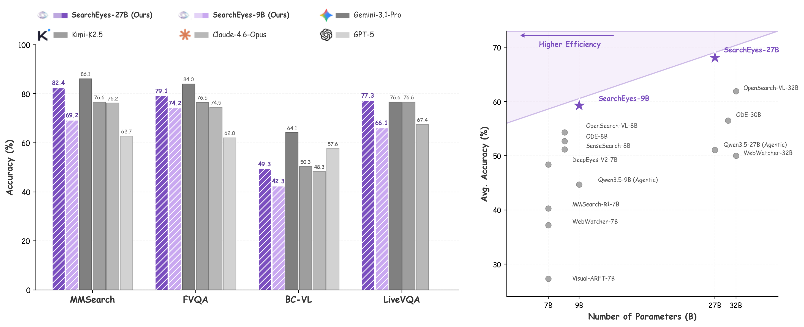
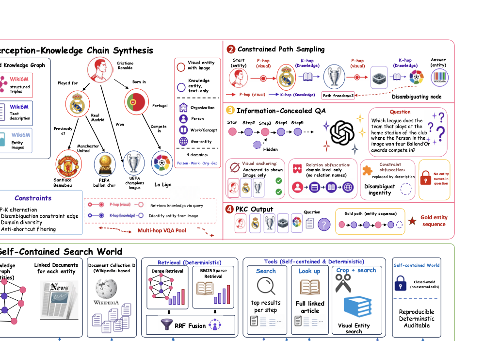
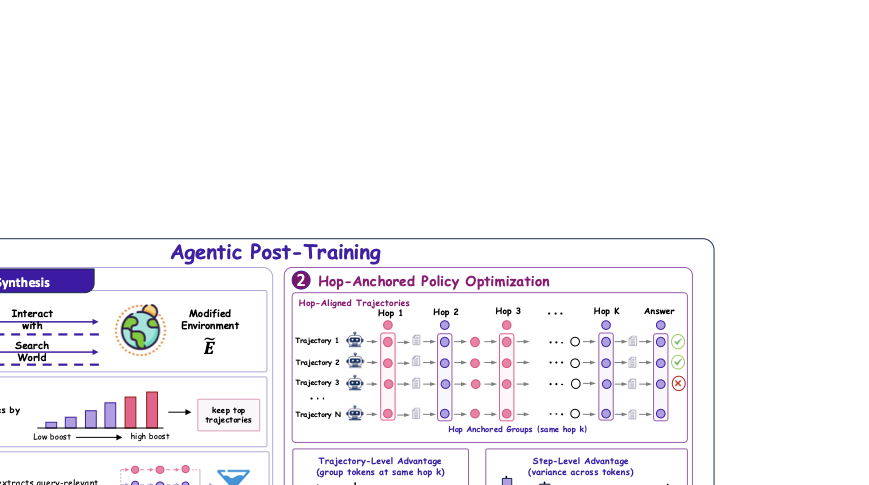

<p align="center">
  
</p>

<h1 align="center">SearchEyes</h1>

<h3 align="center">Towards Frontier Multimodal Deep Search Intelligence<br/>via Search World Simulation</h3>

<p align="center">
  <a href="https://arxiv.org/abs/xxxx.xxxxx"></a>
  <a href="#vissearch-bench"></a>
  <a href="LICENSE"></a>
</p>

---

<p align="center">
  
</p>

<p align="center"><i>
A typed knowledge graph serves as the unified backbone for three tightly-coupled stages:<br/>
PKC question synthesis (left), a self-contained search world for agent interaction (center),<br/>
and hop-anchored reward signals for policy optimization (right).
</i></p>

---

## Highlights

Training multimodal search agents to perform multi-hop reasoning remains challenging due to a fundamental **structural disconnect**: existing pipelines construct training data, search environments, and reward signals independently. SearchEyes resolves this by using a single typed knowledge graph as a simulated search world that unifies all three components:

| Component | Problem in Prior Work | SearchEyes Solution |
|-----------|----------------------|-------------------|
| **Data** | Graph metadata discarded after synthesis → only QA pairs remain | **PKC** retains full entity chain as structural metadata |
| **Environment** | External search engines → irreproducible, costly | **Self-contained world** — deterministic BM25+dense+RRF retrieval |
| **Reward** | Trajectory-level only → sparse for long-horizon | **HaPO** — step-level credit via hop entity anchors |

---

## Performance

### Main Results (6 Benchmarks)

| Model | SimpleVQA | VDR | MMSearch | LiveVQA | BC-VL | FVQA | **Avg.** |
|-------|:---------:|:---:|:--------:|:-------:|:-----:|:----:|:--------:|
| **SearchEyes-27B** | 80.9 | **39.4** | **82.4** | **77.3** | **49.3** | 79.1 | **68.1** |
| **SearchEyes-9B** | 75.4 | 28.3 | 69.2 | 66.1 | 42.3 | 74.2 | 59.3 |
| OpenSearch-VL-32B | 76.2 | 33.8 | 72.3 | 70.5 | 43.8 | 74.7 | 61.9 |
| Gemini-3.1-Pro | – | – | 86.1 | 76.6 | 64.1 | 84.0 | – |
| Kimi-K2.5 | – | – | 76.6 | 76.6 | 50.3 | 76.5 | – |
| Claude-4.6-Opus | – | – | 76.2 | 67.4 | 48.3 | 74.5 | – |
| GPT-5 | 67.3 | 17.6 | 62.7 | – | 57.6 | 62.0 | – |

### Parameter Efficiency

<p align="center">
  
</p>

SearchEyes-9B matches 30B-scale baselines (OpenSearch-VL-30B: 59.8%) with **3.3× fewer parameters**.

---

## Method

### Perception-Knowledge Chain (PKC) Synthesis

<p align="center">
  
</p>

Starting from a typed knowledge graph (Wikidata5M ∩ Wiki6M ∩ Wikipedia images = 1.2M entities, 5.8M triples), PKC samples constrained multi-hop paths:

- **P–K Alternation** — Visual perception hops alternate with knowledge retrieval hops. At least 2 P-hops per chain force genuine multi-modal switching.
- **Treewidth ≥ 2** — Disambiguating constraint edges prevent trivial single-chain solutions. The agent must jointly satisfy the main chain + verify a side constraint.
- **Domain Diversity** — Adjacent hops span different semantic domains (Person, Work, Org, Geo). Each chain covers ≥ 3 domains.
- **Anti-shortcut Filtering** — Hub exclusion (degree > 500), predicate blacklist (47 meta-level predicates), and deduplication by anchor-answer pair.
- **Information Concealment** — No entity name leaks into the question; relation paths are obfuscated to domain-level hints only.

### Agentic Post-Training: SFT + HaPO

<p align="center">
  
</p>

**Stage 1 — SFT with Privileged Generation**

An expert model generates trajectories in a retrieval-boosted environment (β=3.0). Observations are denoised via LLM summarization. Accepted trajectories are exported with *raw* observations (student never sees the boost), with observation tokens masked from the loss.

**Stage 2 — Hop-Anchored Policy Optimization (HaPO)**

```
A_final(i, t) = α · A_episode(i) + (1-α) · A_hop(i, t)
```

| Component | Description |
|-----------|-------------|
| **Hop-anchored grouping** | Trajectories that retrieve the same gold entity vₖ are grouped — equivalent intermediate states despite different queries |
| **Step-level advantage** | Within each group, compare outcomes to isolate the effect of post-anchor actions |
| **Fatal-aware masking** | ≥ M consecutive tool errors → mask all subsequent tokens (prevent learning from degenerate suffixes) |
| **One-sided clamping** | For valid prefixes before fatal steps: retain positive signals, zero out negative |
| **Smooth asymmetric gating** | Sigmoid gate replaces hard PPO clip; γ⁻ > γ⁺ damps negative-advantage updates more strongly |

Training: α=0.3, G=8 rollouts/question, 200 steps on 64×H20 GPUs.

---

## VisSearch Bench

A dedicated 1000-question benchmark for multi-hop visual search with guaranteed P–K alternating structure (min 4 hops, ≥ 2 perception hops, disambiguating constraints).

| Model | VisSearch Acc. |
|-------|:-------------:|
| **SearchEyes-27B** | **24.3** |
| SearchEyes-9B | 18.6 |
| OpenSearch-VL-32B | 9.4 |
| Kimi-K2.5 | 7.2 |
| GPT-5 | 5.4 |

Even frontier proprietary models achieve <10% — reflecting genuine multi-hop difficulty that single-turn reasoning cannot bypass.

```python
import json

with open("data/vissearch_bench.json") as f:
    bench = json.load(f)

# Each entry: question_id, image_path, question, answer, chain, 
#             constraints, num_hops, hop_types, semantic_domains
```

---

## Getting Started

### Installation

```bash
git clone https://github.com/Frostlinx/SearchEyes.git
cd SearchEyes
pip install -e .

# Training dependencies
pip install -e ".[train]"

# Evaluation dependencies  
pip install -e ".[eval]"
```

**Requirements**: Python ≥ 3.10, PyTorch ≥ 2.1

### PKC Data Synthesis

```bash
python -m searcheyes.pgkc_pipeline \
    --kg-path data/wikidata5m/ \
    --wiki6m-path data/wiki6m/ \
    --output-dir data/pkc_output/ \
    --num-questions 10000 \
    --min-hops 3 --max-hops 5
```

### Training

```bash
# Stage 1: SFT
bash scripts/training/run_train.sh

# Stage 2: HaPO
bash scripts/training/run_rl.sh
```

### Evaluation

```bash
bash scripts/evaluation/run_eval.sh \
    --model-path <checkpoint> \
    --benchmark mmsearch \
    --max-turns 50
```

---

## Project Structure

```
SearchEyes/
├── searcheyes/              # Core Python package
│   ├── hapo.py              # HaPO algorithm implementation
│   ├── pgkc_synthesizer.py  # PKC multi-hop question synthesis
│   ├── pgkc_graph.py        # Knowledge graph traversal & typing
│   ├── pgkc_filter.py       # Anti-shortcut filtering pipeline
│   ├── pgkc_pipeline.py     # End-to-end PKC orchestration
│   ├── sft_synthesis.py     # SFT trajectory generation
│   ├── rag_engine.py        # Hybrid BM25 + dense retrieval (RRF)
│   ├── vdr_agent.py         # Multi-turn ReAct search agent
│   ├── vdr_tools.py         # 5 tool implementations
│   ├── reward_fn.py         # Reward function (verl-compatible)
│   └── ...                  # 30+ additional modules
├── scripts/
│   ├── training/            # SFT & HaPO training scripts
│   ├── evaluation/          # Benchmark evaluation
│   └── data_processing/     # KB construction & indexing
├── configs/                 # DeepSpeed & tool configurations
├── data/                    # VisSearch Bench & task data
├── experiments/             # Ablation experiments
└── assets/                  # Paper figures
```

---

## Citation

```bibtex
@article{jiao2026searcheyes,
  title={SearchEyes: Towards Frontier Multimodal Deep Search Intelligence via Search World Simulation},
  author={Jiao, Zhengbo and Cheng, Yiming and Jiang, Yilei and Feng, Kaituo and Huang, Rui and Jiang, Tianyi and Tian, Juanxi and Wang, Qunzhong and Chen, Tailai and Wei, Qianshan and Xiao, Chuan and Rong, Shanyu and Li, Yangfu and Zhou, Yanhan and Zhang, Yifan and Yue, Xiangyu},
  journal={arXiv preprint arXiv:xxxx.xxxxx},
  year={2026}
}
```

## License

This project is released under the [Apache 2.0 License](LICENSE).

## Acknowledgments

We thank the teams behind [Wikidata5M](https://deepgraphlearning.github.io/project/wikidata5m), [Wiki6M / OVEN-Wiki](https://open-vision-language.github.io/oven/), and [verl](https://github.com/volcengine/verl) for their open-source contributions that made this work possible.
